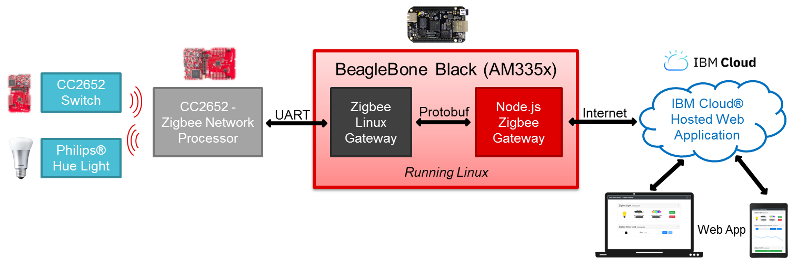

# Zigbee Linux Gateway and Zigbee Sensor to Cloud

## Overview

This project includes both a Linux based gateway written in C/JavaScript and a cloud compatible sample web application. The Linux Zigbee Gateway is capable of interfacing and controlling a local Zigbee Network Processor (ZNP) running on a CC2652 or similar compatible device. The sample web application demonstrates the full extent of the frameworks capability to control the Zigbee Network and to easily interface with the Cloud IoT platforms.
 

### Some of the key Zigbee Sensor to Cloud features include:

- Simple/Modern User Interface
- Mobile support, touch support
- Dynamic Element Updating
- Zigbee Network Control
- Adding/Removing Zigbee Devices
- Receiving Data from Reporting Devices
- Sending Commands/Data to Devices
- Ability to Bind compatible Devices
- IBM Cloud Support

### Current Zigbee Sensor to Cloud Device Support:

- Door Lock
- Door Lock Controller
- On/Off Light
- Dimmable Light
- Color Light
- Switch
- Temperature Sensor
- Thermostat

## Quick Start

Recommended way to start is by following the steps in the [Quick Start Guide](Documents/Z-Stack Linux Gateway - Quick Start Guide.html).

## Content

### Documents

- This directory includes various docs that include the following:
    - [API Document](Documents/Z-Stack Linux Gateway - API document v1.1.pdf)
    - [Developer's Guide](Documents/Z-Stack Linux Gateway - Developer's Guide.html)
    - [Quick Start Guide](Documents/Z-Stack Linux Gateway - Quick Start Guide.html)
    - [User's Guide](Documents/Z-Stack Linux Gateway - User's Guide.html)

- #### Z-Stack Linux Gateway - Developer's Guide.html
  This document dives deeper into the architecture and inner components of the Z-Stack Linux Gateway, Gateway Sample application, and the Node.js Zigbee Gateway.

- #### Z-Stack Linux Gateway - Quick Start Guide.html
  This document aims to help the user quickly evaluate what the Z-Stack Linux Gateway offers.

- #### Z-Stack Linux Gateway - User's Guide.html
  This document provides directions on how to use the gateway, gateway application, and web application.

### Firmware

- Includes all .hex files necessary to run the ZNP devices and sample applications.
- **znp**
    - ZNP UART Images
        - CC1352P2LP_GW_ZNP_UART.hex
        - CC1352R1LP_GW_ZNP_UART.hex
        - CC2652R1LP_GW_ZNP_UART.hex
        - CC2530_GW_ZNP_SRF05+EM_UART.hex
        - CC2538_GW_ZNP_SRF06+EM_UART.hex
    - ZNP USB Images
        - CC2531ZNP_GW_ZNP_USB.hex
        - CC2538_GW_ZNP_EM_StandAlone_USB.hex
- **cc26x2_sampleapps**
    - Door Lock (zed_doorlock_CC26X2R1_LAUNCHXL_tirtos_ccs.hex)
    - Door Lock Controller (zed_doorlockcontroller_CC26X2R1_LAUNCHXL_tirtos_ccs.hex)
    - On/Off Light (zr_light_CC26X2R1_LAUNCHXL_tirtos_ccs.hex)
    - Dimmable Light (zed_light_CC26X2R1_LAUNCHXL_tirtos_ccs.hex)
    - On/Off Switch (zed_sw_CC26X2R1_LAUNCHXL_tirtos_ccs.hex)
    - Temperature Sensor (zed_temperaturesensor_CC26X2R1_LAUNCHXL_tirtos_ccs.hex)
    - Thermostat (zed_thermostat_CC26X2R1_LAUNCHXL_tirtos_ccs.hex)

### Proto_files

- Includes all Protobuf .proto files used to generate the Protobuf code. 
- Reference to make changes or additions to the Protobuf messages being sent between modules.

### source

- Contains all of the source code to build and run the Linux Zigbee Gateway, Node.js Zigbee Gateway and other sample applications.
- Also contains a variety of scripts to assist in initial setup of gateway applications.
- This entire folder must reside on the host to run the examples described in this documentation.
